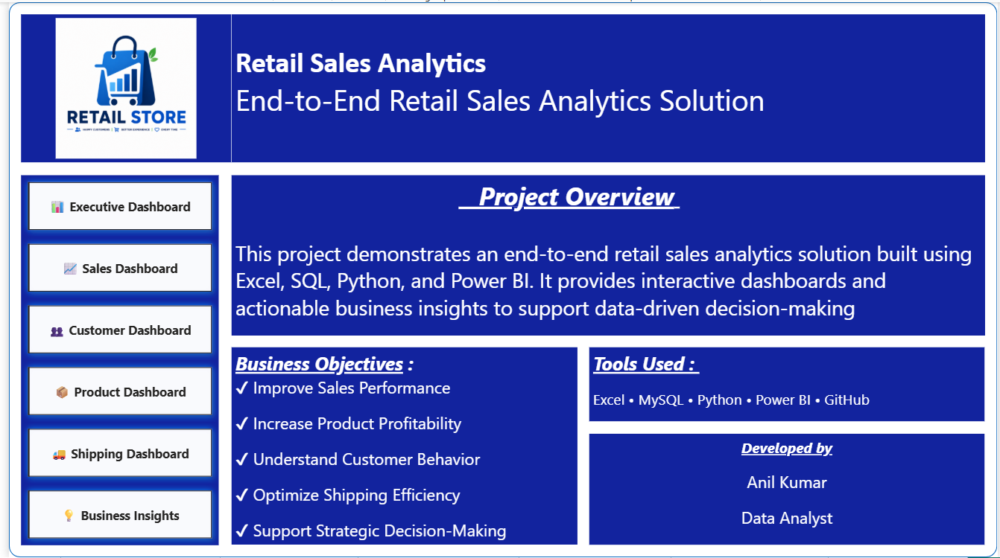
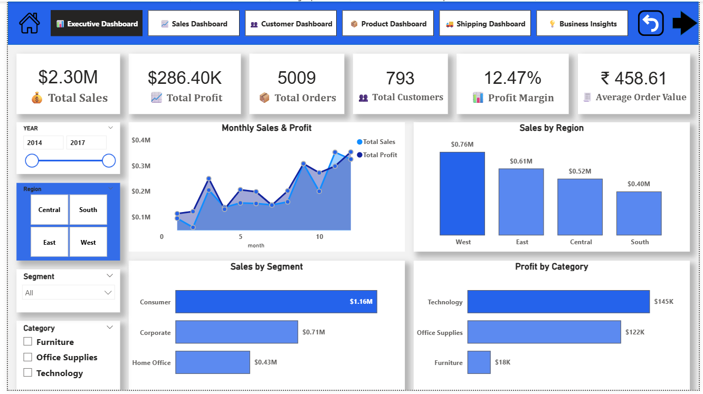
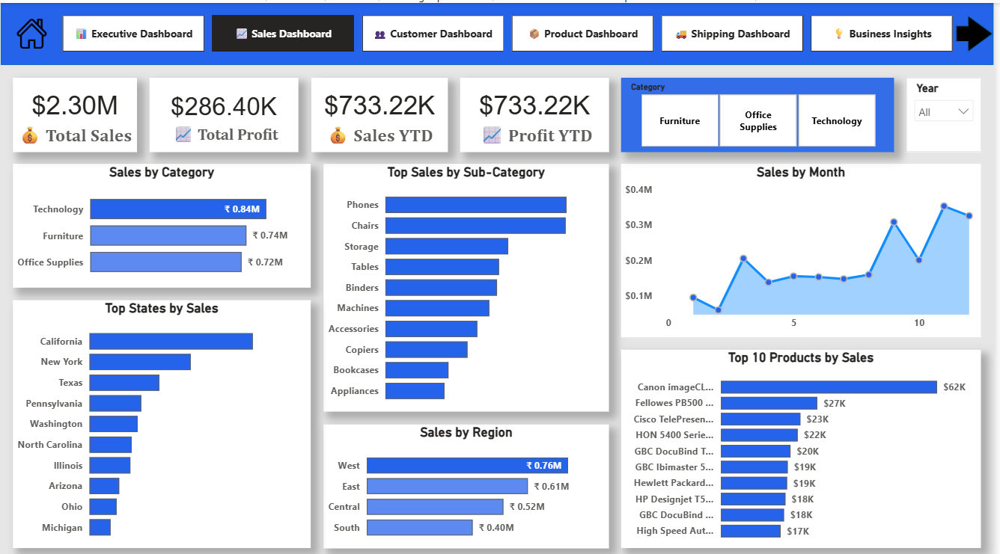
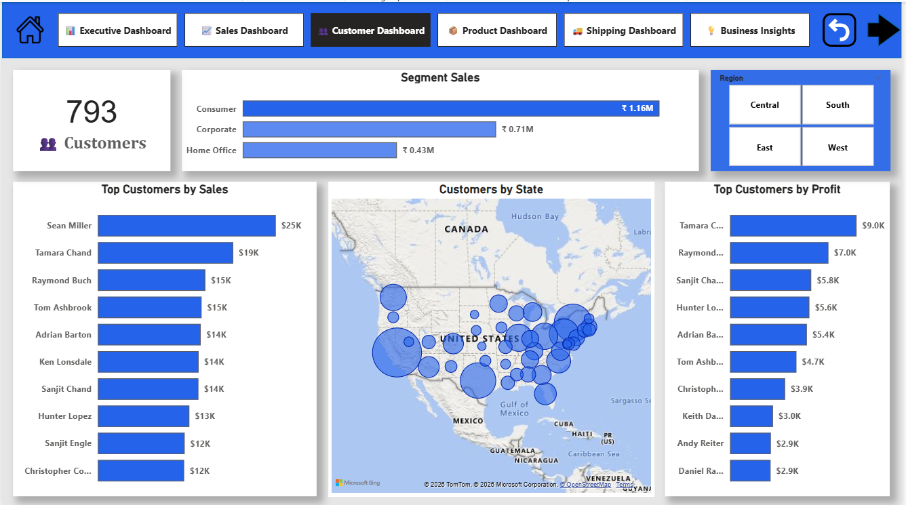
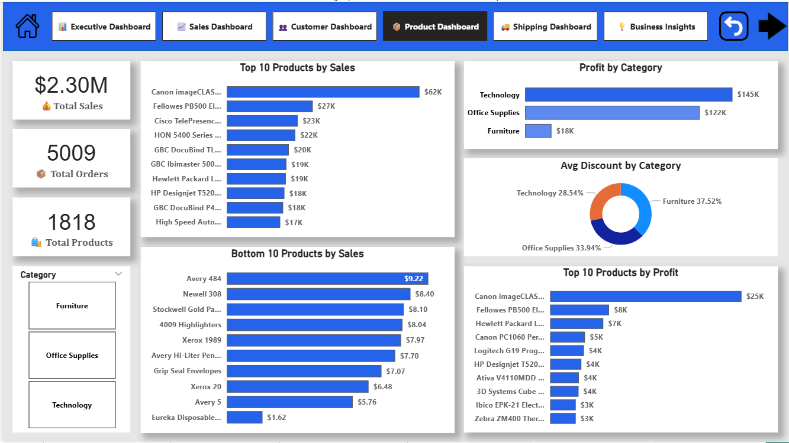
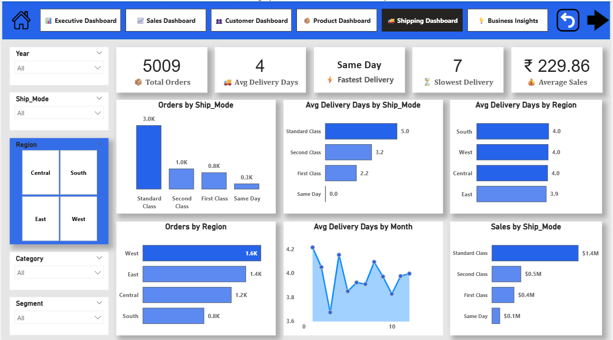
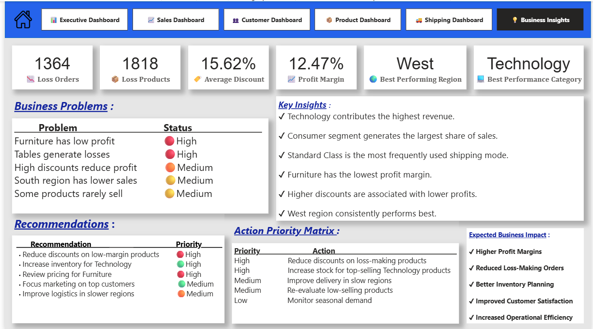

# 📊 Retail Sales Analytics
### End-to-End Retail Sales Analytics Solution

An end-to-end Data Analytics project demonstrating the complete analytics lifecycle, from raw data preparation to executive-level business dashboards. This project leverages **Excel, MySQL, Python, and Power BI** to analyze retail sales data and generate actionable business insights.

# 📌 Project Overview

This project focuses on transforming raw retail transaction data into meaningful business intelligence. The solution includes data cleaning, SQL analysis, exploratory data analysis (EDA), data modeling, DAX calculations, and interactive dashboards to support strategic decision-making.

# 🎯 Business Objectives

- Improve sales performance across regions and product categories.
- Identify high-performing and low-performing products.
- Analyze customer purchasing behavior.
- Evaluate shipping efficiency and delivery performance.
- Support executive decision-making through interactive dashboards.

# 🛠 Tech Stack

| Technology | Purpose |
|------------|----------|
| Microsoft Excel | Data Cleaning & Validation |
| MySQL | Database Design & SQL Analysis |
| Python | Data Cleaning, EDA & Feature Engineering |
| Pandas | Data Manipulation |
| NumPy | Numerical Analysis |
| Matplotlib | Data Visualization |
| Power BI | Dashboard Development |
| Power Query | Data Transformation |
| DAX | Business Metrics & KPIs |
| Git & GitHub | Version Control |


# 📂 Project Workflow

```
Raw Dataset
      │
      ▼
Microsoft Excel
(Data Cleaning & Validation)
      │
      ▼
MySQL Database
(Database Design & SQL Analysis)
      │
      ▼
Python
(EDA & Feature Engineering)
      │
      ▼
Power BI
(Data Modeling • DAX • Dashboards)
      │
      ▼
Business Insights & Recommendations
```


# 📊 Dataset Summary

| Metric | Value |
|--------|------:|
| Total Records | 9,994 |
| Total Orders | 5,009 |
| Total Customers | 793 |
| Total Products | 1,862 |
| Categories | 3 |
| Regions | 4 |


# ⭐ Dashboard Overview

## 🏠 Home Page

Provides an overview of the project, business objectives, technology stack, and navigation.




## 📊 Executive Dashboard

Provides executive-level KPIs and overall business performance.

### Highlights

- Total Sales
- Total Profit
- Profit Margin
- Average Order Value
- Monthly Sales Trend
- Regional Sales Analysis
- Customer Segment Analysis




## 📈 Sales Dashboard

Analyzes sales performance across multiple business dimensions.

### Highlights

- Sales by Category
- Sales by Sub-Category
- Sales by Region
- Top States by Sales
- Monthly Sales Trend
- Top Products




## 👥 Customer Dashboard

Analyzes customer behavior and purchasing patterns.

### Highlights

- Customer Segments
- Top Customers by Sales
- Top Customers by Profit
- Geographic Customer Distribution
- Regional Analysis




## 📦 Product Dashboard

Evaluates product profitability and performance.

### Highlights

- Top Products
- Bottom Products
- Product Profitability
- Category Profit
- Discount Analysis
- Product Performance



## 🚚 Shipping Dashboard

Evaluates logistics and delivery efficiency.

### Highlights

- Orders by Ship Mode
- Average Delivery Days
- Shipping Performance
- Delivery Trends
- Region-wise Shipping Analysis



## 💡 Business Insights Dashboard

Summarizes business findings and strategic recommendations.

### Includes

- Business Problems
- Key Insights
- Strategic Recommendations
- Action Priority Matrix
- Expected Business Impact



# 📈 Key Business Insights

- Technology category generated the highest overall profit.
- Consumer segment contributed the highest share of sales.
- West region consistently outperformed other regions.
- Furniture category recorded the lowest profitability.
- Higher discount levels were associated with lower profits.
- Standard Class was the most frequently used shipping mode.


# 💼 Business Recommendations

- Review discount strategy for low-margin products.
- Increase inventory for high-performing Technology products.
- Re-evaluate pricing strategy for Furniture products.
- Improve logistics performance in slower regions.
- Focus customer retention initiatives on high-value customers.


# 📊 Skills Demonstrated

### Data Preparation

- Data Cleaning
- Data Validation
- Feature Engineering

### SQL

- Database Design
- Joins
- Aggregate Functions
- GROUP BY
- HAVING
- CASE WHEN
- CTEs
- Window Functions
- Views

### Python

- Exploratory Data Analysis
- Data Manipulation
- Data Visualization

### Power BI

- Power Query
- Data Modeling
- Star Schema
- Relationships
- DAX Measures
- KPI Cards
- Interactive Dashboards
- Drill-through
- Business Storytelling

# 📁 Repository Structure

```
Retail_Sales_Analytics
│
├── Dataset
├── Excel
├── SQL_Analysis
├── Python
├── Power BI
├── Dashboard Images
├── README.md
```

# 🚀 Future Enhancements

- Business Requirements Document (BRD)
- Business Report
- Project Presentation
- Interactive Dashboard Publishing
- Portfolio Website Integration


# 👨‍💻 Developed By

**Anil Kumar**

**Data Analyst**

GitHub: https://github.com/thandaanil987

LinkedIn: https://github.com/thandaanil987


## ⭐ If you found this project useful, consider giving this repository a Star.
